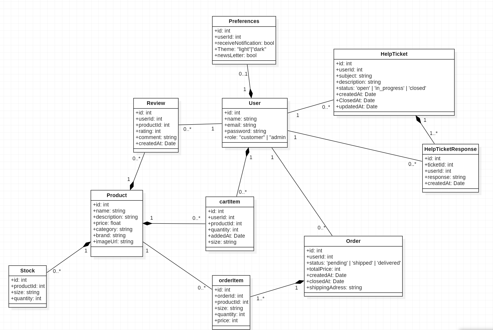
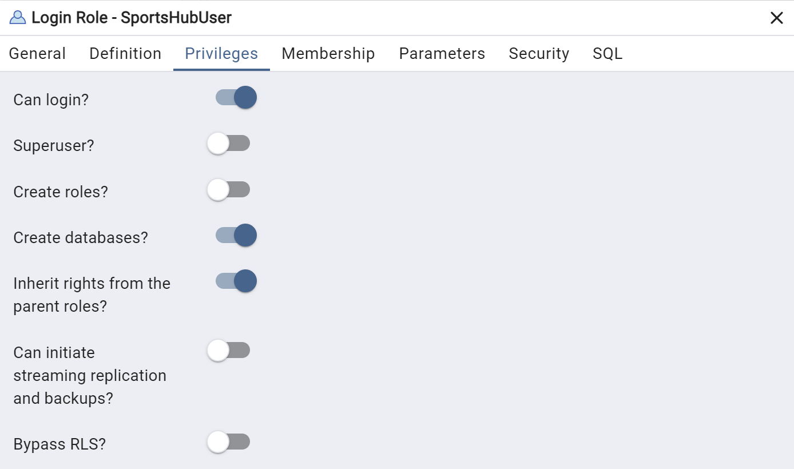
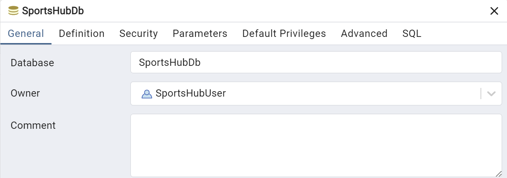
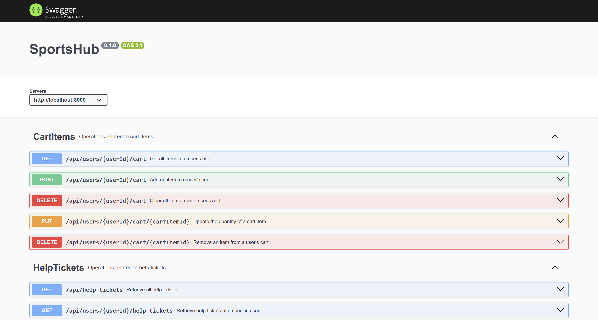
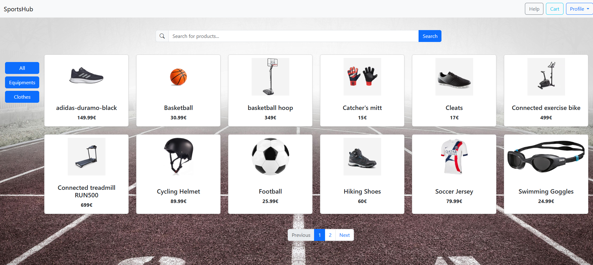

# SportsHub
## Table of Contents
1. [Introduction](#1-introduction)
2. [Code Structure](#2-code-structure)
3. [How to run](#3-how-to-run)
4. [Demo](#4-demo)
5. [Contributors](#5-contributors)

### 1. Introduction
***
This project was carried out as part of our studies at ESILV. For this project, we utilized project management tools such as Jira, as well as versioning tools like GitHub, to streamline development and collaboration.

The primary goal of this project was to create a web application by leveraging the tools and skills we acquired during our studies. We decided to develop a web application focused on the sale of sports equipment. To achieve this, we used several technologies:

- **Database**: PostgreSQL, to efficiently manage all data.
- **Backend**: Developed in Node.js with TypeScript to ensure a robust and strongly-typed structure.
- **Frontend**: Built with Angular to provide a modern and interactive user interface.

Furthermore, to enhance the maintainability of the project, we integrated **Swagger**. This tool allowed us to automatically generate our APIs, making it easier to maintain synchronization between the frontend and backend.

### 2. Code Structure
***

#### Backend

The structure of the backend is quite simple. We have a folder for database creation and Swagger parameters 
[(./Backend/src/config)](./Backend/src/config). We also have a folder for all the different tables of our database and their associations 
[(./Backend/src/models)](./Backend/src/models). Finally, we have a folder for all the different routes of our API 
[(./Backend/src/routes)](./Backend/src/routes).

It is also important to note that the JavaScript code is generated in a `dist` folder [(./Backend/dist)](./Backend/dist) following the same structure as the `src` folder.

For the database, here is the structure:

#### Frontend

For the frontend, you will first find the folder generated by Swagger [(./Frontend/src/generated)](./Frontend/src/generated) which contains all the different services generated for the API.

We have then created different services for the frontend. The services responsible for using the generated API are all in the folder [(./Frontend/src/app/api)](./Frontend/src/app/api). The other services responsible for some logic are [auth.service.ts](./Frontend/src/app/auth.service.ts) and [search.service.ts](./Frontend/src/app/search.service.ts).

Finally, you will find the different components for our website (the names are usually quite clear) in the folder [(./Frontend/src/app)](./Frontend/src/app).

### 3. How to run
***
1. Clone the repository to your local machine.
2. Install the dependencies for both the [Backend](./Backend) and the [Frontend](./Frontend).
    - To do this, run the `npm install` command in the [Backend](./Backend) and [Frontend](./Frontend) folders.
3. Create a new user in PostgreSQL with the following information and privileges:
    - Username: `SportsHubUser`
    - Password: `1234`

    
4. Create a new database in PostgreSQL and assign the created user as the owner:
    - Name: `SportsHubDb`

    
5. After creating the database, start the backend by running the [main.ts](./Backend/src/main.ts) file. Once the backend is running, you can visit http://localhost:3000/api-docs/ to see all the APIs and test the connection with the database.

    
6. Start the frontend by running the `ng serve` command in the [Frontend](./Frontend) folder. Then, go to http://localhost:4200/ to view the website. If you have completed all the previous steps correctly, you should see the homepage of the website. Enjoy !

    

### 4. Demo
***

YouTube link : [SportsHub](https://youtu.be/ZpB0aJl4PXo)

### 5. Contributors
***
|            Name            |       Pseudo       |                   Email                   |
| :------------------------: | :----------------: | :---------------------------------------: |
|    MOLLY-MITTON Clément    |     Bliights       |       clement.mollymitton@gmail.com       |
|      VERBECQ Diane         |     dianevrb       |        diane.verbecq@edu.devinci.fr       |
|        VIGNAL Raphaël      |     RafTafTaf      |       raphael.vignal@edu.devinci.fr       |
|       ESCALIER Paul        |     PaulEscalier   |       paul.escalier@edu.devinci.fr        |